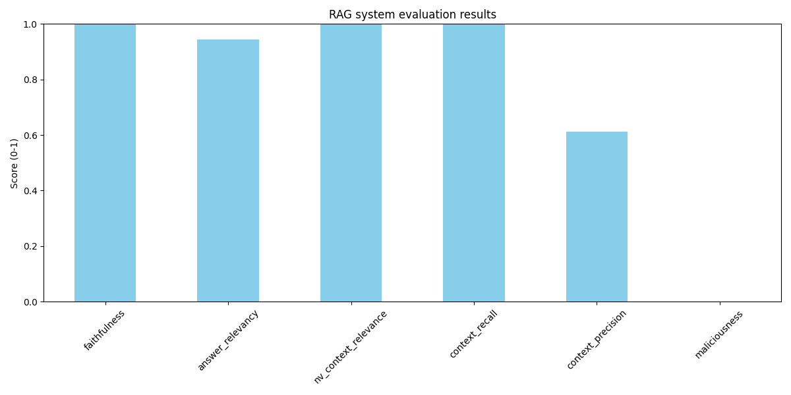

## Voy - RAG case study
*Author: [Ameen Ahmed](https://github.com/ameen-a)*

This system extracts content from Voy's [Zendesk FAQ pages](https://joinvoy.zendesk.com/hc/en-gb), processes it into searchable chunks, and uses an LLM to answer user questions based on the most relevant chunks. We also include an evaluation script to measure the performance of the system and reduce hallucinations.

### Architecture
The system contains the following components:
#### Data Pipeline
- **Extraction**: Fetches content from Voy's Zendesk knowledge base using their API.
- **Processing**: Cleans the HTML, normalises text, and splits the documents into chunks.
- **Embedding**: Converts text chunks into vector embeddings using OpenAI's embedding model (`text-embedding-3-small`).
- **Storage**: Stores embeddings in a ChromaDB vector database for semantic similarity search.

#### Question Answering Flow
1. **Query Processing**: The user submits a question through web interface or CLI.
2. **Retrieval**: The system finds the most relevant document chunks using vector similarity search.
3. **Context Formation**: The retrieved chunks are formatted into a context prompt.
4. **Generation**: The LLM, `GPT-4o`, generates an answer based on the context and question.
5. **Evaluation**: The system evaluates answers for factual accuracy and hallucination potential using the RAGAS framework.

### Evaluation Strategy
The system is evaluated using the RAGAS framework which captures the several impartant metric, including factuality, answer relevancy, and context precision. The `run_evals.py` script runs this evaluation on a set of test questions found in `data/evals/eval_dataset.json`. This dataset also contains the ground truth answers for each question, which are used to calculate certain RAGAS metrics like faithfulness and answer relevancy. A particular important metric is context precision, which measures the proportion of the retrieved context that is relevant to the question - it's a good measure of how much the retrieved context is actually useful for answering the question.

In a producti

Talk about context recall 

- Section for chunking
- Section for embedding
- Section for retrieval

- Mention eval pipeline

### Libraries

- **LangChain**: For RAG pipeline components, text splitting, and LLM integration
- **OpenAI**: For vector embeddings model and LLM
- **ChromaDB**: Vector database for storing and retrieving embeddings
- **Flask**: Web server for the browser interface
- **RAGAS**: Evaluation framework for measuring RAG system performance
- **Pandas/Matplotlib**: For analysis of evaluation results
- **BeautifulSoup**: For HTML parsing

### Setup 

Evaluation Examples
The system has been tested with sample questions:
"What payment options are available?"
"What is the titration pathway for wegovy?"
"How much weight loss can I expect with GLP-1 medications?"
Evaluation metrics include faithfulness, answer relevancy, and context precision to ensure responses are accurate and helpful.

Future Improvements
- revisit the retieval and embedding strategy because it's quite primitive. Discuss hybrid retrieval
- fix chunking strategy to maybe be per document, rather than split arbitrarily
- proper eval pipleine
- having an evaluator LLM which can flag; also a prompt formatting LLM which can format the context for the LLM, but these add latency
- Add more robust hallucination detection mechanisms (talk through some examples)_

